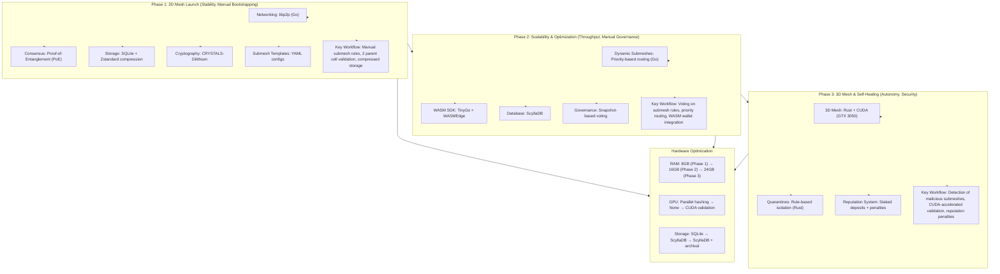

This project needs a lot of time and hardware requirements. Help me accomplish my goal of serving humanity new technology for better life. Buy me a coffee! >>
https://ko-fi.com/joedeldalioan

or send me some love via paypal or crypto >>

- **Paypal:** paypal.me/Dalioan
- **Bitcoin (Unisat):** bc1qu8pknsrwvssspq4c6a5j4p3x835phq8n3ajcgw
- **Solana:** FNEdD3PWMLwbNKxtaHy3W2NVfRJ7wqDNx4M9je8Xc6Mw
- **Tron:** TGVrpryTJAmWEPWTKYB3tGRv5gWhE2g9Lo
- **Metamask:** 0x9F32B8346bD728DF3AB7775971705D02fb86dD9c

# Quantum-Secure Dynamic Mesh Ledger (QSD)

> **Rebrand notice (Major Update):** the platform is migrating from the transitional name **QSD** back to **QSD**, and introducing the native coin **Cell (CELL)**. Configuration files, environment variables, and HTTP headers that used the `QSD` / `QSD_*` / `X-QSD-*` names continue to work during the deprecation window. See [`docs/docs/REBRAND_NOTES.md`](docs/docs/REBRAND_NOTES.md) for the full migration table and [`docs/docs/CELL_TOKENOMICS.md`](docs/docs/CELL_TOKENOMICS.md) for the coin specification.

**QSD** is the public product name (previously transitionally **QSD**). Quantum-Secure Dynamic Mesh Ledger (QSD) is a non-AI, decentralized electronic cash system designed for quantum resistance and hardware-agnostic operation. The native coin is **Cell (CELL)** — see `docs/docs/CELL_TOKENOMICS.md`.

## Overview
QSD supports both **Windows 10+** and **Linux (Ubuntu 24.04+)**. macOS support is in development.

QSD is developed in phases:

- **Phase 1: 2D Mesh Launch**  
  Focus on stability and manual bootstrapping using libp2p for networking, Proof-of-Entanglement consensus, SQLite with Zstandard compression for storage, and ML-DSA-87 (NIST FIPS 204) for quantum-safe cryptography with optimized performance.

- **Phase 2: Scalability & Optimization**  
  Introduces dynamic submeshes, priority-based routing, WASM SDK integration, and ScyllaDB for high throughput.

- **Phase 3: 3D Mesh & Self-Healing**  
  Adds 3D mesh validation, rule-based quarantines, reputation system, and CUDA acceleration.

## Repository layout (QSD monorepo)

This directory (**`QSD/`**) is the **QSD ledger node** (electronic cash / token APIs, consensus, storage, mining, governance, bridge). The production website is **`deploy/landing/`** (QSD.tech). Sibling products live under **`apps/`** (Hive, edge agent, tray monitor, NGC sidecar). See the root **`README.md`** one level up for the full map and current feature summary.

### Optional: NGC sidecar and NVIDIA-lock (HTTP API)

The **`apps/QSD-nvidia-ngc`** sidecar can push GPU proof bundles to the node. Enable **`[api] nvidia_lock`** in config (and **`QSD_NGC_INGEST_SECRET`**) so selected ledger HTTP routes require a recent GPU-attested proof. Optional **`nvidia_lock_expected_node_id`** / **`QSD_NVIDIA_LOCK_EXPECTED_NODE_ID`** must match **`QSD_NGC_PROOF_NODE_ID`** on the sidecar when you use proof binding. Optional **`nvidia_lock_proof_hmac_secret`** / **`QSD_NVIDIA_LOCK_PROOF_HMAC_SECRET`** pairs with **`QSD_NGC_PROOF_HMAC_SECRET`** on the sidecar for **`QSD_proof_hmac`**. For non-CGO builds, set **`QSD_JWT_HMAC_SECRET`** (or **`jwt_hmac_secret`** in config) for JWT HMAC. Production: **`strict_secrets`** / **`QSD_STRICT_SECRETS`**, optional **`nvidia_lock_gate_p2p`** / **`QSD_NVIDIA_LOCK_GATE_P2P`** (libp2p tx drops when no proof), dashboard **`/api/metrics/prometheus`** for scraping (**JWT** or **`metrics_scrape_secret`** / **`QSD_DASHBOARD_METRICS_SCRAPE_SECRET`** with **`X-QSD-Metrics-Scrape-Secret`** or **Bearer**), and **15/min** on **`GET .../ngc-challenge`** (sidecar honors **429** **`Retry-After`**; stagger validators if many share one NAT IP). Operator notes: [deploy/README.md](deploy/README.md); roadmap scope: [docs/docs/ROADMAP.md](docs/docs/ROADMAP.md); sidecar: [../apps/QSD-nvidia-ngc/README.md](../apps/QSD-nvidia-ngc/README.md).

### Submesh profiles (optional)

Set **`[network] submesh_config`** (or **`QSD_SUBMESH_CONFIG`**) to a **`config/micropayments.toml`**-style file (see **`config/QSD.toml.example`**). Relative paths resolve next to your main config file. **Multiple profiles** use **`[[submeshes]]`** in TOML or **`submeshes:`** in YAML. When **any** submesh is loaded, **HTTP** **`POST /api/v1/wallet/send`** and **libp2p** ingress use the same rules: **fee + geotag** must match a submesh, and **max_tx_size** applies to the serialized payload. **Mint / token-create** HTTP routes use the **strictest** **max_tx_size** across loaded submeshes. Failures return **422** on the API and **drop** P2P messages before validation. **Interactive submesh CLI** (when stdin is a TTY) **adds or updates** entries in the same in-memory manager as the file seed—both apply together at runtime. **Prometheus** (dashboard **`/api/metrics/prometheus`**) exposes **`QSD_submesh_*`** counters for P2P and API reject reasons.

## Getting Started

> **New to QSD?** Read the end-to-end operator wiki first:
> [`docs/docs/OPERATOR_GUIDE.md`](docs/docs/OPERATOR_GUIDE.md). It
> answers the three questions every new operator asks — *do I need an
> NVIDIA GPU, do I need a paid NGC plan, and do I have to sync to your
> VPS?* — before you touch a build command.

### Prerequisites

- Go 1.20 or higher
- SQLite3
- Git

### Build and Run

**Windows (PowerShell):**
```powershell
# Build with CGO enabled (full features)
.\scripts\build.ps1

# Run the node
.\QSD.exe
```

**Linux (Ubuntu 24.04+):**
```bash
# Install dependencies
sudo apt install -y build-essential cmake git libssl-dev libsqlite3-dev golang-go

# Clone repository
git clone https://github.com/quantum-ledger/QSD.git
cd QSD

# Build liboqs (quantum-safe library)
chmod +x scripts/rebuild_liboqs.sh scripts/build.sh scripts/run.sh
./scripts/rebuild_liboqs.sh

# Build QSD
./scripts/build.sh

# Run the node
./scripts/run.sh
```
<｜tool▁calls▁begin｜><｜tool▁call▁begin｜>
grep

**For production deployment on Ubuntu VPS, see:** [docs/UBUNTU_DEPLOYMENT.md](docs/UBUNTU_DEPLOYMENT.md)

The node will start and initialize libp2p networking. Logs will be written to `QSD.log`.

**Note**: The main `build.ps1` script automatically enables CGO and liboqs for full feature support, including quantum-safe cryptography (ML-DSA-87), SQLite storage, and API server.

## Performance Optimizations

QSD includes several performance optimizations:

- **Memory Pool Optimization**: 5-10% faster signing through reduced allocations
- **Signature Compression**: 50% size reduction using zstd compression
- **Storage Compression**: 60-70% compression ratio for transaction data
- **Batch Signing**: 10-100x faster for multiple transactions
- **Fast Verification**: 1.76x faster than ECDSA (0.19 ms vs 0.33 ms)

See [docs/PERFORMANCE_BENCHMARK_REPORT.md](docs/PERFORMANCE_BENCHMARK_REPORT.md) for detailed performance metrics.

## Project Structure

- `cmd/QSD/` - Main application entry point
- `pkg/networking/` - libp2p networking setup
- `pkg/consensus/` - Proof-of-Entanglement consensus implementation
- `pkg/storage/` - SQLite storage with Zstandard compression
- `pkg/crypto/` - Quantum-safe cryptography (ML-DSA-87, optimized with memory pooling and compression)
- `config/` - YAML configuration for submesh templates
- `internal/logging/` - Logging setup with rotation and levels

## Comparative Analysis

See [docs/COMPARATIVE_ANALYSIS.md](docs/COMPARATIVE_ANALYSIS.md) for a detailed comparison of QSD with Blockchain and DAG technologies.

## Visualization of QSD

Below is a flowchart summarizing how the Quantum-Secure Dynamic Mesh Ledger (QSD) works across its three development phases:



## Hardware Optimization

| Resource | Phase 1           | Phase 2                 | Phase 3                  |
|----------|-------------------|-------------------------|--------------------------|
| RAM      | 8GB (nodes)       | 16GB (WASM + ScyllaDB)  | 24GB (3D mesh)           |
| GPU      | Parallel hashing  | —                       | CUDA validation          |
| Storage  | SQLite (500GB HDD)| ScyllaDB (800GB HDD)    | ScyllaDB + archival      |

## Key Differences from AI-Driven QSD

| Feature           | AI Version           | Non-AI Version          |
|-------------------|----------------------|------------------------|
| Submesh Balancing | AI predicts traffic  | Manual routing tables   |
| Attack Detection  | DeepSeek-R1 flags threats | Rule-based thresholds |
| Governance        | AI drafts proposals  | Community Snapshot voting |
| Complexity        | High (ML models)     | Moderate (YAML/configs) |

## Example Use Case

- Phase 1: A developer creates a "micropayments" submesh via YAML, sets low fees.
- Phase 2: Nodes vote to increase block size for this submesh during peak hours.
- Phase 3: Malicious nodes spamming the submesh are isolated via manual voting.

## Advantages

- Simpler Debugging: No black-box AI logic.
- Lower Resource Use: Eliminates GPU-heavy ML workloads.
- Transparency: Rules and thresholds are manually defined.

## Developer 👨‍💻

Developed by [Blackbeard](https://blackbeard.one) | [Ten Titanics](https://tentitanics.com) | [GitHub](https://github.com/quantum-ledger)

© 2023-2025 Blackbeard. All rights reserved.
