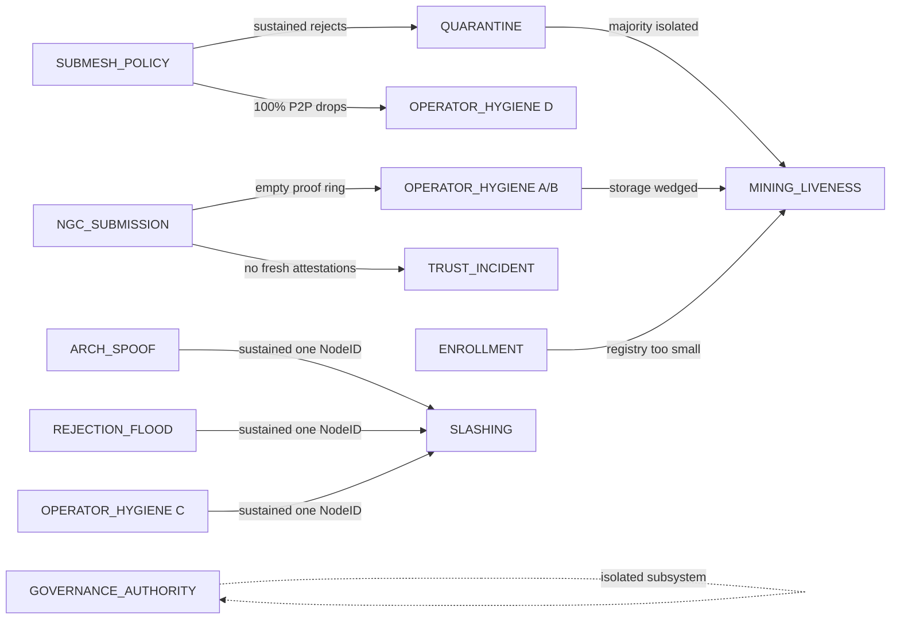

# QSD Operator Runbooks — Master Index

This is the operator's first page when paged for any
`QSD*` Prometheus alert. It lists all 53 alerts in
[`alerts_QSD.example.yml`](../../../deploy/prometheus/alerts_QSD.example.yml),
maps each to its dedicated runbook section, and shows
the cross-subsystem escalation paths in one place.

> **Coverage invariant.** Every alert in
> [`alerts_QSD.example.yml`](../../../deploy/prometheus/alerts_QSD.example.yml)
> carries an anchored `runbook_url`, and every
> `runbook_url` resolves to an existing markdown
> anchor. This is enforced in CI by
> [`scripts/check_runbook_coverage.py`](../../../../scripts/check_runbook_coverage.py)
> via the `runbook-coverage` job in
> [`.github/workflows/validate-deploy.yml`](../../../../.github/workflows/validate-deploy.yml).
> A PR that adds an alert without a resolvable
> `runbook_url`, or breaks an existing anchor, fails
> CI before merge.

## How to use this page

- **Paged for an alert?** Jump to the alphabetized
  table in [§1](#1-alert--runbook-anchor-master-table)
  and click the alert name. The link lands you on
  the exact `### 3.x Mode X — <alert>` triage section
  of the right runbook.
- **Want to learn the runbook surface area?** Read
  [§2 Per-runbook subsystem cards](#2-per-runbook-subsystem-cards) —
  each card names the subsystem, the alerts it
  covers, the canonical "when to read this" sentence,
  and the companion runbooks.
- **Investigating a multi-alert cascade?** [§3 Cross-
  runbook escalation map](#3-cross-runbook-escalation-map)
  shows the upstream/downstream relationships in a
  single mermaid diagram + the canonical concurrent-
  alert patterns.
- **Onboarding to on-call?** Read §1 once to see the
  full alert surface, then §2 in subsystem order,
  then §3 to internalize the escalation mesh.

---

## 1. Alert ↔ runbook anchor master table

Alphabetized by alert name. **Severity** column is
authoritative (matches `labels.severity` in the
alerts file). **Triage section** is a click-through
link directly to the relevant `### 3.x Mode X` (or
§7.x in REJECTION_FLOOD) anchor.

| Alert | Severity | Group | Triage section |
|---|---|---|---|
| `QSDAttestArchSpoofCCSubjectMismatch`         | **critical** | `QSD-v2-attest-archspoof`        | [`ARCH_SPOOF_INCIDENT.md` §3.3](ARCH_SPOOF_INCIDENT.md#33-mode-c--QSDattestarchspoofccsubjectmismatch) |
| `QSDAttestArchSpoofGPUNameMismatch`           | warning      | `QSD-v2-attest-archspoof`        | [`ARCH_SPOOF_INCIDENT.md` §3.2](ARCH_SPOOF_INCIDENT.md#32-mode-b--QSDattestarchspoofgpunamemismatch) |
| `QSDAttestArchSpoofUnknownArchBurst`          | warning      | `QSD-v2-attest-archspoof`        | [`ARCH_SPOOF_INCIDENT.md` §3.1](ARCH_SPOOF_INCIDENT.md#31-mode-a--QSDattestarchspoofunknownarchburst) |
| `QSDAttestHashrateOutOfBand`                  | warning      | `QSD-v2-attest-hashrate`         | [`OPERATOR_HYGIENE_INCIDENT.md` §3.3](OPERATOR_HYGIENE_INCIDENT.md#33-mode-c--QSDattesthashrateoutofband) |
| `QSDAttestRejectionFieldRunesMaxNearCap`      | info         | `QSD-v2-attest-recent-rejections`| [`REJECTION_FLOOD.md` §7.5](REJECTION_FLOOD.md#75-mode-e--QSDattestrejectionfieldrunesmaxnearcap) |
| `QSDAttestRejectionFieldTruncationSustained`  | warning      | `QSD-v2-attest-recent-rejections`| [`REJECTION_FLOOD.md` §7.4](REJECTION_FLOOD.md#74-mode-d--QSDattestrejectionfieldtruncationsustained) |
| `QSDAttestRejectionPerMinerRateLimited`       | warning      | `QSD-v2-attest-recent-rejections`| [`REJECTION_FLOOD.md` §7.3](REJECTION_FLOOD.md#73-mode-c--QSDattestrejectionperminerratelimited) |
| `QSDAttestRejectionPersistCompactionsHigh`    | warning      | `QSD-v2-attest-recent-rejections`| [`REJECTION_FLOOD.md` §7.1](REJECTION_FLOOD.md#71-mode-a--QSDattestrejectionpersistcompactionshigh) |
| `QSDAttestRejectionPersistHardCapDropping`    | warning      | `QSD-v2-attest-recent-rejections`| [`REJECTION_FLOOD.md` §7.2](REJECTION_FLOOD.md#72-mode-b--QSDattestrejectionpersisthardcapdropping) |
| `QSDBridgeOpErrorBurst`                       | warning      | `QSD-contracts-bridge`           | [`CONTRACTS_BRIDGE_INCIDENT.md` §3.2](CONTRACTS_BRIDGE_INCIDENT.md#32-mode-b--QSDbridgeoperrorburst)         |
| `QSDContractExecuteErrorRate`                 | warning      | `QSD-contracts-bridge`           | [`CONTRACTS_BRIDGE_INCIDENT.md` §3.1](CONTRACTS_BRIDGE_INCIDENT.md#31-mode-a--QSDcontractexecuteerrorrate)   |
| `QSDGovAuthorityCountTooLow`                  | **critical** | `QSD-v2-governance`              | [`GOVERNANCE_AUTHORITY_INCIDENT.md` §3.3](GOVERNANCE_AUTHORITY_INCIDENT.md#33-mode-c--QSDgovauthoritycounttoolow) |
| `QSDGovAuthorityThresholdCrossed`             | warning      | `QSD-v2-governance`              | [`GOVERNANCE_AUTHORITY_INCIDENT.md` §3.2](GOVERNANCE_AUTHORITY_INCIDENT.md#32-mode-b--QSDgovauthoritythresholdcrossed) |
| `QSDGovAuthorityVoteRecorded`                 | info         | `QSD-v2-governance`              | [`GOVERNANCE_AUTHORITY_INCIDENT.md` §3.1](GOVERNANCE_AUTHORITY_INCIDENT.md#31-mode-a--QSDgovauthorityvoterecorded) |
| `QSDHotReloadApplyFailures`                   | warning      | `QSD-hot-reload`                 | [`HOT_RELOAD_INCIDENT.md` §3.1](HOT_RELOAD_INCIDENT.md#31-mode-a--QSDhotreloadapplyfailures)                |
| `QSDHotReloadDryRunDegraded`                  | info         | `QSD-hot-reload`                 | [`HOT_RELOAD_INCIDENT.md` §3.2](HOT_RELOAD_INCIDENT.md#32-mode-b--QSDhotreloaddryrundegraded)               |
| `QSDMiningAutoRevokeBurst`                    | **critical** | `QSD-v2-mining-slashing`         | [`SLASHING_INCIDENT.md` §3.4](SLASHING_INCIDENT.md#34-mode-d--QSDminingautorevokeburst) |
| `QSDMiningBondedDustDropped`                  | warning      | `QSD-v2-mining-enrollment`       | [`ENROLLMENT_INCIDENT.md` §3.5](ENROLLMENT_INCIDENT.md#35-mode-e--QSDminingbondeddustdropped) |
| `QSDMiningChainStuck`                         | **critical** | `QSD-v2-mining-liveness`         | [`MINING_LIVENESS.md` §3.1](MINING_LIVENESS.md#31-mode-a--QSDminingchainstuck) |
| `QSDMiningEnrollmentRejectionsBurst`          | warning      | `QSD-v2-mining-enrollment`       | [`ENROLLMENT_INCIDENT.md` §3.4](ENROLLMENT_INCIDENT.md#34-mode-d--QSDminingenrollmentrejectionsburst) |
| `QSDMiningMempoolBacklog`                     | warning      | `QSD-v2-mining-liveness`         | [`MINING_LIVENESS.md` §3.2](MINING_LIVENESS.md#32-mode-b--QSDminingmempoolbacklog) |
| `QSDMiningPendingUnbondMajority`              | warning      | `QSD-v2-mining-enrollment`       | [`ENROLLMENT_INCIDENT.md` §3.3](ENROLLMENT_INCIDENT.md#33-mode-c--QSDminingpendingunbondmajority) |
| `QSDMiningRegistryEmpty`                      | warning      | `QSD-v2-mining-enrollment`       | [`ENROLLMENT_INCIDENT.md` §3.1](ENROLLMENT_INCIDENT.md#31-mode-a--QSDminingregistryempty) |
| `QSDMiningRegistryShrinkingFast`              | warning      | `QSD-v2-mining-enrollment`       | [`ENROLLMENT_INCIDENT.md` §3.2](ENROLLMENT_INCIDENT.md#32-mode-b--QSDminingregistryshrinkingfast) |
| `QSDMiningSlashApplied`                       | warning      | `QSD-v2-mining-slashing`         | [`SLASHING_INCIDENT.md` §3.1](SLASHING_INCIDENT.md#31-mode-a--QSDminingslashapplied) |
| `QSDMiningSlashedDustBurst`                   | **critical** | `QSD-v2-mining-slashing`         | [`SLASHING_INCIDENT.md` §3.2](SLASHING_INCIDENT.md#32-mode-b--QSDminingslasheddustburst) |
| `QSDMiningSlashRejectionsBurst`               | warning      | `QSD-v2-mining-slashing`         | [`SLASHING_INCIDENT.md` §3.3](SLASHING_INCIDENT.md#33-mode-c--QSDminingslashrejectionsburst) |
| `QSDNGCChallengeRateLimited`                  | warning      | `QSD-nvidia-lock`                | [`NGC_SUBMISSION_INCIDENT.md` §3.1](NGC_SUBMISSION_INCIDENT.md#31-mode-a--QSDngcchallengeratelimited) |
| `QSDNGCProofIngestRejectBurst`                | warning      | `QSD-nvidia-lock`                | [`NGC_SUBMISSION_INCIDENT.md` §3.2](NGC_SUBMISSION_INCIDENT.md#32-mode-b--QSDngcproofingestrejectburst) |
| `QSDNoTransactionsStored`                     | warning      | `QSD-throughput`                 | [`OPERATOR_HYGIENE_INCIDENT.md` §3.4](OPERATOR_HYGIENE_INCIDENT.md#34-mode-d--QSDnotransactionsstored) |
| `QSDNvidiaLockHTTPBlocksSpike`                | warning      | `QSD-nvidia-lock`                | [`OPERATOR_HYGIENE_INCIDENT.md` §3.1](OPERATOR_HYGIENE_INCIDENT.md#31-mode-a--QSDnvidialockhttpblocksspike) |
| `QSDNvidiaLockP2PRejects`                     | warning      | `QSD-nvidia-lock`                | [`OPERATOR_HYGIENE_INCIDENT.md` §3.2](OPERATOR_HYGIENE_INCIDENT.md#32-mode-b--QSDnvidialockp2prejects) |
| `QSDP2PGossipIngressStalled`                  | warning      | `QSD-p2p`                        | [`NETWORKING_INCIDENT.md` §3.2](NETWORKING_INCIDENT.md#32-mode-b--QSDp2pgossipingressstalled)         |
| `QSDP2PNoPeers`                               | warning      | `QSD-p2p`                        | [`NETWORKING_INCIDENT.md` §3.1](NETWORKING_INCIDENT.md#31-mode-a--QSDp2pnopeers)                      |
| `QSDP2PWalletIngressDedupeBurst`              | info         | `QSD-p2p`                        | [`NETWORKING_INCIDENT.md` §3.3](NETWORKING_INCIDENT.md#33-mode-c--QSDp2pwalletingressdedupeburst)     |
| `QSDPeerAttesterAbsent`                       | warning      | `QSD-v2-peer-attester`           | [`DEPLOYMENT_TOPOLOGY.md` §8 Mode A](DEPLOYMENT_TOPOLOGY.md#mode-a--QSDpeerattesterabsent) |
| `QSDQuarantineAnySubmesh`                     | warning      | `QSD-quarantine`                 | [`QUARANTINE_INCIDENT.md` §3.1](QUARANTINE_INCIDENT.md#31-mode-a--QSDquarantineanysubmesh) |
| `QSDQuarantineMajorityIsolated`               | **critical** | `QSD-quarantine`                 | [`QUARANTINE_INCIDENT.md` §3.2](QUARANTINE_INCIDENT.md#32-mode-b--QSDquarantinemajorityisolated) |
| `QSDReputationBanRatioHigh`                   | warning      | `QSD-reputation`                 | [`REPUTATION_INCIDENT.md` §3.1](REPUTATION_INCIDENT.md#31-mode-a--QSDreputationbanratiohigh)      |
| `QSDReputationScoreCollapse`                  | info         | `QSD-reputation`                 | [`REPUTATION_INCIDENT.md` §3.2](REPUTATION_INCIDENT.md#32-mode-b--QSDreputationscorecollapse)     |
| `QSDStorageReadyFailing`                      | **critical** | `QSD-storage`                    | [`STORAGE_INCIDENT.md` §3.2](STORAGE_INCIDENT.md#32-mode-b--QSDstoragereadyfailing)        |
| `QSDStorageWriteErrorBurst`                   | warning      | `QSD-storage`                    | [`STORAGE_INCIDENT.md` §3.1](STORAGE_INCIDENT.md#31-mode-a--QSDstoragewriteerrorburst)     |
| `QSDStubActive`                               | **critical** | `QSD-stub-active`                | [`STUB_DEPLOYMENT_INCIDENT.md`](STUB_DEPLOYMENT_INCIDENT.md) (kind-dispatched) |
| `QSDSubmeshAPISustained422`                   | warning      | `QSD-submesh`                    | [`SUBMESH_POLICY_INCIDENT.md` §3.2](SUBMESH_POLICY_INCIDENT.md#32-mode-b--QSDsubmeshapisustained422) |
| `QSDSubmeshP2PRejects`                        | warning      | `QSD-submesh`                    | [`SUBMESH_POLICY_INCIDENT.md` §3.1](SUBMESH_POLICY_INCIDENT.md#31-mode-a--QSDsubmeshp2prejects) |
| `QSDTrustAggregatorStale`                     | **critical** | `QSD-trust-redundancy`           | [`TRUST_INCIDENT.md` §3.6](TRUST_INCIDENT.md#36-mode-f--QSDtrustaggregatorstale) |
| `QSDTrustAttestationsBelowFloor`              | warning      | `QSD-trust-redundancy`           | [`TRUST_INCIDENT.md` §3.3](TRUST_INCIDENT.md#33-mode-c--QSDtrustattestationsbelowfloor) |
| `QSDTrustIngestRejectRateElevated`            | warning      | `QSD-trust-transparency`         | [`TRUST_INCIDENT.md` §3.2](TRUST_INCIDENT.md#32-mode-b--QSDtrustingestrejectrateelevated) |
| `QSDTrustLastAttestedStale`                   | warning      | `QSD-trust-redundancy`           | [`TRUST_INCIDENT.md` §3.5](TRUST_INCIDENT.md#35-mode-e--QSDtrustlastattestedstale) |
| `QSDTrustNGCServiceDegraded`                  | warning      | `QSD-trust-redundancy`           | [`TRUST_INCIDENT.md` §3.4](TRUST_INCIDENT.md#34-mode-d--QSDtrustngcservicedegraded) |
| `QSDTrustNoAttestationsAccepted`              | warning      | `QSD-trust-transparency`         | [`TRUST_INCIDENT.md` §3.1](TRUST_INCIDENT.md#31-mode-a--QSDtrustnoattestationsaccepted) |
| `QSDWalletMintBurst`                          | warning      | `QSD-wallet`                     | [`WALLET_INCIDENT.md` §3.3](WALLET_INCIDENT.md#33-mode-c--QSDwalletmintburst)            |
| `QSDWalletSendErrorRate`                      | warning      | `QSD-wallet`                     | [`WALLET_INCIDENT.md` §3.1](WALLET_INCIDENT.md#31-mode-a--QSDwalletsenderrorrate)         |
| `QSDWalletStorageErrorBurst`                  | warning      | `QSD-wallet`                     | [`WALLET_INCIDENT.md` §3.2](WALLET_INCIDENT.md#32-mode-b--QSDwalletstorageerrorburst)     |

**Total: 54 alerts. Severity distribution: 9 critical
/ 40 warning / 5 info.**

---

## 2. Per-runbook subsystem cards

One card per runbook, in subsystem-cluster order
(loosely: chain liveness → mining lifecycle →
attestation defence → trust pipeline → governance →
operational hygiene). Each card lists alerts
covered, the canonical "when to read this" framing,
and bidirectional companions.

### `MINING_LIVENESS.md` — chain-liveness sentinels

The keystone runbook. Catches cases where the chain
**stops producing blocks** (`QSDMiningChainStuck`)
or where mempool backlog is climbing without
correspondingly higher block production
(`QSDMiningMempoolBacklog`).

| Alert | Mode | Severity |
|---|---|---|
| [`QSDMiningChainStuck`](MINING_LIVENESS.md#31-mode-a--QSDminingchainstuck)         | A | **critical** |
| [`QSDMiningMempoolBacklog`](MINING_LIVENESS.md#32-mode-b--QSDminingmempoolbacklog) | B | warning      |

**When to read:** an "is the chain alive?" page. If
`QSDMiningChainStuck` is firing, all other alerts
are downstream symptoms — fix this first.

**Companions:** [`ENROLLMENT_INCIDENT.md`](ENROLLMENT_INCIDENT.md)
(registry too small to produce blocks),
[`QUARANTINE_INCIDENT.md`](QUARANTINE_INCIDENT.md)
(majority of validators isolated),
[`OPERATOR_HYGIENE_INCIDENT.md`](OPERATOR_HYGIENE_INCIDENT.md)
(storage backend wedging block production).

---

### `ENROLLMENT_INCIDENT.md` — miner-registry health

Five-mode runbook for the v2 mining registry: empty
registry, fast shrinkage, pending-unbond majority,
enrollment-rejection burst, and bonded-dust drops.
Covers the miner-lifecycle bonding/unbonding
machinery.

| Alert | Mode | Severity |
|---|---|---|
| [`QSDMiningRegistryEmpty`](ENROLLMENT_INCIDENT.md#31-mode-a--QSDminingregistryempty)                       | A | warning |
| [`QSDMiningRegistryShrinkingFast`](ENROLLMENT_INCIDENT.md#32-mode-b--QSDminingregistryshrinkingfast)       | B | warning |
| [`QSDMiningPendingUnbondMajority`](ENROLLMENT_INCIDENT.md#33-mode-c--QSDminingpendingunbondmajority)       | C | warning |
| [`QSDMiningEnrollmentRejectionsBurst`](ENROLLMENT_INCIDENT.md#34-mode-d--QSDminingenrollmentrejectionsburst) | D | warning |
| [`QSDMiningBondedDustDropped`](ENROLLMENT_INCIDENT.md#35-mode-e--QSDminingbondeddustdropped)               | E | warning |

**When to read:** registry-side anomaly. Mode A is
the upstream cause for several `MINING_LIVENESS`
escalations.

**Companions:** [`MINING_LIVENESS.md`](MINING_LIVENESS.md),
[`SLASHING_INCIDENT.md`](SLASHING_INCIDENT.md)
(slashing → auto-revoke → registry shrinkage),
[`ARCH_SPOOF_INCIDENT.md`](ARCH_SPOOF_INCIDENT.md)
(Mode B's hardware-swap branch flows through the
unenroll → unbond → re-enroll cycle).

---

### `SLASHING_INCIDENT.md` — economic punishment

Four-mode runbook for v2 slashing events. Covers
the per-event slash, dust-burst aggregate, slash-
rejection burst (slashes proposed but failing), and
auto-revoke burst (NodeIDs being kicked out).

| Alert | Mode | Severity |
|---|---|---|
| [`QSDMiningSlashApplied`](SLASHING_INCIDENT.md#31-mode-a--QSDminingslashapplied)                 | A | warning      |
| [`QSDMiningSlashedDustBurst`](SLASHING_INCIDENT.md#32-mode-b--QSDminingslasheddustburst)         | B | **critical** |
| [`QSDMiningSlashRejectionsBurst`](SLASHING_INCIDENT.md#33-mode-c--QSDminingslashrejectionsburst) | C | warning      |
| [`QSDMiningAutoRevokeBurst`](SLASHING_INCIDENT.md#34-mode-d--QSDminingautorevokeburst)           | D | **critical** |

**When to read:** slashing activity is firing.
Mode B (dust-burst) and Mode D (auto-revoke) both
escalate to critical because they signal mass-cheat
detection.

**Companions:** [`ARCH_SPOOF_INCIDENT.md`](ARCH_SPOOF_INCIDENT.md),
[`REJECTION_FLOOD.md`](REJECTION_FLOOD.md),
[`OPERATOR_HYGIENE_INCIDENT.md`](OPERATOR_HYGIENE_INCIDENT.md)
(sustained Mode C arch-spoof + Mode C hashrate from
one NodeID is the canonical cross-axis cheat
slashing case).

---

### `ARCH_SPOOF_INCIDENT.md` — adversarial arch-claim defence

Three-mode runbook for the §4.6.2 arch-spoof family.
Detects miners lying about their hardware:
unknown_arch (typo or out-of-allowlist), gpu_name
mismatch (HMAC bundle contradicts claimed arch — the
economic-cheat case), and CC subject mismatch (CC
leaf cert subject contradicts claimed arch — the
cryptographic-anomaly case).

| Alert | Mode | Severity |
|---|---|---|
| [`QSDAttestArchSpoofUnknownArchBurst`](ARCH_SPOOF_INCIDENT.md#31-mode-a--QSDattestarchspoofunknownarchburst)   | A | warning      |
| [`QSDAttestArchSpoofGPUNameMismatch`](ARCH_SPOOF_INCIDENT.md#32-mode-b--QSDattestarchspoofgpunamemismatch)     | B | warning      |
| [`QSDAttestArchSpoofCCSubjectMismatch`](ARCH_SPOOF_INCIDENT.md#33-mode-c--QSDattestarchspoofccsubjectmismatch) | C | **critical** |

**When to read:** arch-spoof activity is firing.
Mode C is critical because Subject CN mismatches
are cryptographic anomalies, not operator typos.

**Companions:** [`SLASHING_INCIDENT.md`](SLASHING_INCIDENT.md),
[`REJECTION_FLOOD.md`](REJECTION_FLOOD.md),
[`ENROLLMENT_INCIDENT.md`](ENROLLMENT_INCIDENT.md),
[`OPERATOR_HYGIENE_INCIDENT.md`](OPERATOR_HYGIENE_INCIDENT.md).

---

### `REJECTION_FLOOD.md` — §4.6 attestation rejection ring

Five-mode runbook for the rejection-ring forensic
store + plumbing health. Modes A/B catch the persister's
hard-cap defences (compaction churn / hard-cap drops),
Mode C catches per-miner rate-limiting, Modes D/E
catch field-truncation and rune-cap pressure.

> **Note:** alert anchors here are at §7.x (not §3.x)
> because §3 in this runbook is the multi-step
> operator triage matrix; §7 is the per-mode alert
> reference.

| Alert | Mode | Severity |
|---|---|---|
| [`QSDAttestRejectionPersistCompactionsHigh`](REJECTION_FLOOD.md#71-mode-a--QSDattestrejectionpersistcompactionshigh)     | A | warning |
| [`QSDAttestRejectionPersistHardCapDropping`](REJECTION_FLOOD.md#72-mode-b--QSDattestrejectionpersisthardcapdropping)     | B | warning |
| [`QSDAttestRejectionPerMinerRateLimited`](REJECTION_FLOOD.md#73-mode-c--QSDattestrejectionperminerratelimited)           | C | warning |
| [`QSDAttestRejectionFieldTruncationSustained`](REJECTION_FLOOD.md#74-mode-d--QSDattestrejectionfieldtruncationsustained) | D | warning |
| [`QSDAttestRejectionFieldRunesMaxNearCap`](REJECTION_FLOOD.md#75-mode-e--QSDattestrejectionfieldrunesmaxnearcap)         | E | info    |

**When to read:** the §4.6 rejection ring is showing
plumbing pressure (Modes A/B/C) or field-shape
pressure (Modes D/E). Modes D/E are usually
sustained-attack signals.

**Companions:** [`SLASHING_INCIDENT.md`](SLASHING_INCIDENT.md),
[`ARCH_SPOOF_INCIDENT.md`](ARCH_SPOOF_INCIDENT.md).

---

### `TRUST_INCIDENT.md` — QSD.tech transparency aggregate

Six-mode runbook for the trust subsystem's *aggregate
response* alerts. Catches cases where the validator's
view of the QSD.tech transparency pipeline degrades:
no attestations accepted, ingest reject rate
elevated, attestations below floor, NGC service
degraded, last-attested stale, aggregator stale.

| Alert | Mode | Severity |
|---|---|---|
| [`QSDTrustNoAttestationsAccepted`](TRUST_INCIDENT.md#31-mode-a--QSDtrustnoattestationsaccepted)         | A | warning      |
| [`QSDTrustIngestRejectRateElevated`](TRUST_INCIDENT.md#32-mode-b--QSDtrustingestrejectrateelevated)     | B | warning      |
| [`QSDTrustAttestationsBelowFloor`](TRUST_INCIDENT.md#33-mode-c--QSDtrustattestationsbelowfloor)         | C | warning      |
| [`QSDTrustNGCServiceDegraded`](TRUST_INCIDENT.md#34-mode-d--QSDtrustngcservicedegraded)                 | D | warning      |
| [`QSDTrustLastAttestedStale`](TRUST_INCIDENT.md#35-mode-e--QSDtrustlastattestedstale)                   | E | warning      |
| [`QSDTrustAggregatorStale`](TRUST_INCIDENT.md#36-mode-f--QSDtrustaggregatorstale)                       | F | **critical** |

**When to read:** trust-degradation is firing. This
is the *aggregate-response* runbook;
[`NGC_SUBMISSION_INCIDENT.md`](NGC_SUBMISSION_INCIDENT.md)
is the *per-request gate* upstream cause.

**Companions:** [`NGC_SUBMISSION_INCIDENT.md`](NGC_SUBMISSION_INCIDENT.md)
(upstream cause, bidirectional cross-links from
Modes A/B/D).

---

### `NGC_SUBMISSION_INCIDENT.md` — QSD.tech transparency per-request gate

Two-mode runbook for the NGC submission gate. Mode A
catches `GET /monitoring/ngc-challenge` rate-limit
hits (15 req/IP/min). Mode B catches
`POST /monitoring/ngc-proof` ingest reject bursts
across the nine closed-enum reject reasons
(`hmac` / `nonce` / `unauthorized` / `body_read` /
`body_too_large` / `invalid_json` / `missing_cuda_hash`
/ `ingest_disabled` / `other`).

| Alert | Mode | Severity |
|---|---|---|
| [`QSDNGCChallengeRateLimited`](NGC_SUBMISSION_INCIDENT.md#31-mode-a--QSDngcchallengeratelimited)     | A | warning |
| [`QSDNGCProofIngestRejectBurst`](NGC_SUBMISSION_INCIDENT.md#32-mode-b--QSDngcproofingestrejectburst) | B | warning |

**When to read:** the per-request submission gate is
seeing elevated reject rates. This is the
*upstream cause* for both [`TRUST_INCIDENT.md`](TRUST_INCIDENT.md)
(no fresh attestations) and
[`OPERATOR_HYGIENE_INCIDENT.md`](OPERATOR_HYGIENE_INCIDENT.md)
Modes A/B (NVIDIA-lock proof ring empty).

**Companions:** [`TRUST_INCIDENT.md`](TRUST_INCIDENT.md),
[`OPERATOR_HYGIENE_INCIDENT.md`](OPERATOR_HYGIENE_INCIDENT.md).

---

### `QUARANTINE_INCIDENT.md` — submesh isolation events

Two-mode runbook for the mesh's immune system. Mode A
catches per-submesh isolation, Mode B catches the
critical case where a majority of submeshes are
isolated simultaneously (consensus-stall risk).

| Alert | Mode | Severity |
|---|---|---|
| [`QSDQuarantineAnySubmesh`](QUARANTINE_INCIDENT.md#31-mode-a--QSDquarantineanysubmesh)             | A | warning      |
| [`QSDQuarantineMajorityIsolated`](QUARANTINE_INCIDENT.md#32-mode-b--QSDquarantinemajorityisolated) | B | **critical** |

**When to read:** quarantine activity is firing.
Mode B is critical because majority isolation can
wedge consensus.

**Companions:** [`SUBMESH_POLICY_INCIDENT.md`](SUBMESH_POLICY_INCIDENT.md)
(upstream per-tx cause; quarantine is the aggregate
response),
[`MINING_LIVENESS.md`](MINING_LIVENESS.md)
(quarantine majority → consensus stall).

---

### `SUBMESH_POLICY_INCIDENT.md` — per-tx submesh policy gate

Two-mode runbook for the submesh policy enforcement
layer (route + size caps). Mode A catches P2P-side
rejects, Mode B catches the API-side sustained 422s.

| Alert | Mode | Severity |
|---|---|---|
| [`QSDSubmeshP2PRejects`](SUBMESH_POLICY_INCIDENT.md#31-mode-a--QSDsubmeshp2prejects)            | A | warning |
| [`QSDSubmeshAPISustained422`](SUBMESH_POLICY_INCIDENT.md#32-mode-b--QSDsubmeshapisustained422)  | B | warning |

**When to read:** policy-gate rejects are climbing.
This is the per-request gate; sustained activity
escalates to [`QUARANTINE_INCIDENT.md`](QUARANTINE_INCIDENT.md).

**Companions:** [`QUARANTINE_INCIDENT.md`](QUARANTINE_INCIDENT.md),
[`MINING_LIVENESS.md`](MINING_LIVENESS.md),
[`REJECTION_FLOOD.md`](REJECTION_FLOOD.md),
[`OPERATOR_HYGIENE_INCIDENT.md`](OPERATOR_HYGIENE_INCIDENT.md)
(when submesh-policy rejects 100% of P2P traffic,
the throughput sentinel co-fires).

---

### `GOVERNANCE_AUTHORITY_INCIDENT.md` — multisig authority rotation

Three-mode runbook for the constitutional layer. Mode
A is the per-vote info ping (intentionally low-noise
— just so other authority members see the vote
happened), Mode B catches threshold crossings (M-of-N
about to flip), Mode C is the critical case where the
authority count drops below the operating minimum.

| Alert | Mode | Severity |
|---|---|---|
| [`QSDGovAuthorityVoteRecorded`](GOVERNANCE_AUTHORITY_INCIDENT.md#31-mode-a--QSDgovauthorityvoterecorded)         | A | info         |
| [`QSDGovAuthorityThresholdCrossed`](GOVERNANCE_AUTHORITY_INCIDENT.md#32-mode-b--QSDgovauthoritythresholdcrossed) | B | warning      |
| [`QSDGovAuthorityCountTooLow`](GOVERNANCE_AUTHORITY_INCIDENT.md#33-mode-c--QSDgovauthoritycounttoolow)           | C | **critical** |

**When to read:** multisig rotation activity. Mode A
is informational ("hey, a vote happened"); Mode C is
the critical case requiring immediate governance
intervention.

**Companions:** governance-authority is operationally
isolated from the data-plane runbooks — no direct
cascade companions.

---

### `WALLET_INCIDENT.md` — wallet HTTP API health

Three-mode runbook for the `/api/v1/wallet/*` HTTP surface.
Mode A is the keystone send-side error-rate alert (drilled
by per-result tag), Mode B catches storage-backend wedges
visible from the wallet's read or write paths, Mode C is
the supply-inflation tripwire (sustained admin mint volume).

| Alert | Mode | Severity |
|---|---|---|
| [`QSDWalletSendErrorRate`](WALLET_INCIDENT.md#31-mode-a--QSDwalletsenderrorrate)         | A | warning |
| [`QSDWalletStorageErrorBurst`](WALLET_INCIDENT.md#32-mode-b--QSDwalletstorageerrorburst) | B | warning |
| [`QSDWalletMintBurst`](WALLET_INCIDENT.md#33-mode-c--QSDwalletmintburst)                 | C | warning |

**When to read:** wallet handler-side activity is failing
(Mode A drill-by-tag tells you why), the storage backend
is rejecting reads or writes from the wallet (Mode B), or
sustained admin mint volume requires authorization audit
(Mode C). Submesh-policy and dedupe rejects on the wallet
surface are NOT covered here — they have their own
counters and runbooks.

**Companions:** [`STUB_DEPLOYMENT_INCIDENT.md`](STUB_DEPLOYMENT_INCIDENT.md)
(`kind="wallet"` / `"dilithium"` if the wallet didn't
initialize at boot — Mode A `tx_create_failed` /
`no_wallet_service` paths),
[`OPERATOR_HYGIENE_INCIDENT.md`](OPERATOR_HYGIENE_INCIDENT.md)
(`QSDNoTransactionsStored` co-fires with Mode B when the
storage wedge is system-wide),
[`NGC_SUBMISSION_INCIDENT.md`](NGC_SUBMISSION_INCIDENT.md)
(empty NVIDIA-lock proof ring → Mode A
`nvidia_lock_blocked` path),
[`SUBMESH_POLICY_INCIDENT.md`](SUBMESH_POLICY_INCIDENT.md)
(gate-side rejects, complementary surface),
[`GOVERNANCE_AUTHORITY_INCIDENT.md`](GOVERNANCE_AUTHORITY_INCIDENT.md)
(authority vote audit trail for Mode C legitimate-cause
campaigns),
[`MINING_LIVENESS.md`](MINING_LIVENESS.md)
(downstream chain-stall risk after sustained Mode B).

---

### `STORAGE_INCIDENT.md` — storage-backend health (SQLite / file / Scylla)

Two-mode runbook for the storage layer beneath the wallet
and p2p ingress paths. Mode A catches sustained
`store_transaction` write-error bursts (storage rejecting
new state); Mode B is the lowest-level health-probe
signal — `Ready()` itself failing — which is critical
because the validator cannot meaningfully participate in
consensus without a working storage backend.

Closes a long-standing gap: the SQLite backend's
`StoreTransaction` had **no Prometheus instrumentation
at all** before this commit — write failures were
log-only. The new `QSD_storage_op_total{op,result}`
counter (5 ops × 2 results, all pre-populated at 0)
makes per-op success-vs-error visible at the storage
layer itself.

| Alert | Mode | Severity |
|---|---|---|
| [`QSDStorageWriteErrorBurst`](STORAGE_INCIDENT.md#31-mode-a--QSDstoragewriteerrorburst) | A | warning  |
| [`QSDStorageReadyFailing`](STORAGE_INCIDENT.md#32-mode-b--QSDstoragereadyfailing)       | B | **critical** |

**When to read:** storage backend (SQLite/FileStorage/Scylla)
is rejecting writes (Mode A) or reporting itself fully
offline via the `Ready()` probe (Mode B). Distinct from
[`WALLET_INCIDENT.md`](WALLET_INCIDENT.md) Mode B —
that one fires when the wallet API surface sees the
failure end-to-end; STORAGE_INCIDENT fires when the
storage layer itself is the source of truth, regardless
of whether the call originated from the wallet API or
from p2p ingress.

**Companions:** [`WALLET_INCIDENT.md`](WALLET_INCIDENT.md)
(`QSDWalletStorageErrorBurst` is the wallet-API-surface
symptom of the same failure class),
[`OPERATOR_HYGIENE_INCIDENT.md`](OPERATOR_HYGIENE_INCIDENT.md)
(`QSDNoTransactionsStored` is the aggregate-throughput
sentinel that follows Mode A within ~30m if unresolved),
[`MINING_LIVENESS.md`](MINING_LIVENESS.md)
(`QSDMiningChainStuck` follows Mode B if a majority of
validators hit it — e.g. shared Scylla cluster outage),
[`QUARANTINE_INCIDENT.md`](QUARANTINE_INCIDENT.md)
(submesh isolation behaviour follows when a majority hit
Mode B together).

---

### `NETWORKING_INCIDENT.md` — libp2p peer-graph health

Two-mode runbook for the libp2p peer graph beneath every
gossip-driven subsystem. Mode A catches **full islanding**
(zero connected peers); Mode B catches the more subtle case
of **peers-but-no-inbound-gossip** (one-way partition or
silently-dropped pubsub subscription).

Closes a long-standing instrumentation gap: before this
commit, `pkg/networking` had **zero** Prometheus
instrumentation. Peer count, gossip volume, and
connection churn were all log-only signals invisible to
alerting. The new `QSD_p2p_peers_connected{provider}`
gauge (pulled at scrape time) and
`QSD_p2p_messages_total{direction}` counter pair
(push-incremented from libp2p send/receive paths)
expose the layer to alerting at last. The
provider="live|none" label keeps unit-test / dev nodes
from false-firing the no-peers alert.

| Alert | Mode | Severity |
|---|---|---|
| [`QSDP2PNoPeers`](NETWORKING_INCIDENT.md#31-mode-a--QSDp2pnopeers)                                 | A | warning |
| [`QSDP2PGossipIngressStalled`](NETWORKING_INCIDENT.md#32-mode-b--QSDp2pgossipingressstalled)       | B | warning |
| [`QSDP2PWalletIngressDedupeBurst`](NETWORKING_INCIDENT.md#33-mode-c--QSDp2pwalletingressdedupeburst) | C | info    |

**When to read:** validator is islanded from the network
(Mode A) or peers exist but no gossip is landing (Mode B).
Both alerts point at the libp2p layer; if the network is
fine but you're seeing application-level rejects, escalate
to [`SUBMESH_POLICY_INCIDENT.md`](SUBMESH_POLICY_INCIDENT.md)
or [`QUARANTINE_INCIDENT.md`](QUARANTINE_INCIDENT.md)
instead.

**Companions:** [`QUARANTINE_INCIDENT.md`](QUARANTINE_INCIDENT.md)
(`QSDQuarantineMajorityIsolated` is the policy-side
companion to Mode A's network-side islanding;
`QSDQuarantineAnySubmesh` is the disambiguator for
Mode B — co-firing means peers are muted by submesh
policy rather than broken at the network layer),
[`MINING_LIVENESS.md`](MINING_LIVENESS.md)
(`QSDMiningChainStuck` will follow within ~30m if a
majority of validators hit Mode A together — full chain
stall),
[`OPERATOR_HYGIENE_INCIDENT.md`](OPERATOR_HYGIENE_INCIDENT.md)
(`QSDNoTransactionsStored` follows when gossip is
starved AND the local node has no ingress path),
[`SUBMESH_POLICY_INCIDENT.md`](SUBMESH_POLICY_INCIDENT.md)
(when the network is fine but submesh-policy rejects are
dominating — orthogonal to this runbook).

---

### `HOT_RELOAD_INCIDENT.md` — runtime config hot-reload health

Two-mode runbook for the in-process config hot-reload
subsystem. Mode A catches **sustained apply failures**
(live config swaps being rejected — the validator is
running on stale config); Mode B is the lower-severity
precursor case where **the on-disk config can't pass a
dry-run** (next planned apply will fail).

Closes a long-standing alerting gap. The hot-reload
subsystem already exposed five Prometheus counters and
four gauges (`QSD_hot_reload_*` in
`pkg/monitoring/prometheus_scrape.go`), but no alert
ever fired against them. A jammed apply path or a
dry-run that couldn't parse the on-disk file were both
invisible until a downstream subsystem broke.

| Alert | Mode | Severity |
|---|---|---|
| [`QSDHotReloadApplyFailures`](HOT_RELOAD_INCIDENT.md#31-mode-a--QSDhotreloadapplyfailures)   | A | warning |
| [`QSDHotReloadDryRunDegraded`](HOT_RELOAD_INCIDENT.md#32-mode-b--QSDhotreloaddryrundegraded) | B | info    |

**When to read:** live config swaps are failing
(Mode A) or the on-disk file can't pass the dry-run
guard (Mode B — precursor signal). Distinguish by
checking which `QSD_hot_reload_last_dry_run_*` gauge
is at 0.

**Companions:** [`GOVERNANCE_AUTHORITY_INCIDENT.md`](GOVERNANCE_AUTHORITY_INCIDENT.md)
(authority-list reload failures cascade through Mode A;
authority-count policy failures cascade through Mode
B's `policy_ok=0` path),
[`SUBMESH_POLICY_INCIDENT.md`](SUBMESH_POLICY_INCIDENT.md)
(submesh-policy reload failures cascade through both
modes).

---

### `REPUTATION_INCIDENT.md` — peer-reputation tracker health

Two-mode runbook for the peer-reputation trackers
(`pkg/networking.ReputationTracker`). Mode A catches a
**high banned-ratio** (50%+ peers banned for ≥10m on a
tracker with ≥4 peers) — either a coordinated attack or a
penalty-config regression. Mode B is a softer info-level
drift signal: **min-score sliding toward the ban
threshold** sustained for ≥30m, often a precursor to
Mode A.

Closes a long-standing operational gap. The reputation
trackers existed and were wired into BFT and evidence
ingress, but had **two large defects**: (a) decay was
never started — `Start()` was created but never called,
so penalties accumulated permanently; (b) zero
Prometheus exposition. Both are fixed: `Start()` is
invoked at validator boot (with matching `defer Stop()`),
and the new `QSD_reputation_*{tracker}` gauges expose
state via the `pkg/monitoring/repmetrics` leaf.

| Alert | Mode | Severity |
|---|---|---|
| [`QSDReputationBanRatioHigh`](REPUTATION_INCIDENT.md#31-mode-a--QSDreputationbanratiohigh) | A | warning |
| [`QSDReputationScoreCollapse`](REPUTATION_INCIDENT.md#32-mode-b--QSDreputationscorecollapse) | B | info |

**When to read:** majority of peers in a tracker are
banned (Mode A) or scores are drifting toward the ban
threshold (Mode B). Two trackers in scope:
`tracker="tx"` (transaction gossip, lenient config) and
`tracker="evidence"` (consensus evidence, strict
config).

**Companions:** [`QUARANTINE_INCIDENT.md`](QUARANTINE_INCIDENT.md)
(quarantine isolates per submesh; reputation bans per
topic — different layers of the same defence),
[`SLASHING_INCIDENT.md`](SLASHING_INCIDENT.md)
(`tracker="evidence"` Mode A often co-fires when
evidence gossip is degraded — peers get
`EventProtocolViolation` for relaying malformed
evidence even when honest),
[`NETWORKING_INCIDENT.md`](NETWORKING_INCIDENT.md)
(`QSDP2PNoPeers` is the polar opposite — Mode A/B
both require non-zero `peers_total`).

---

### `CONTRACTS_BRIDGE_INCIDENT.md` — smart contracts + atomic-swap bridge

Two-mode runbook covering both the WASM contract
execution path and the atomic-swap bridge protocol.
Mode A catches sustained dominant-error contract
execution (>50% error ratio with ≥1 call/min over 15m);
Mode B catches a bridge op error burst (>0.2/min over
10m) with explicit per-op interpretation tables for
lock / redeem / refund.

Closes a long-standing instrumentation gap: both
`pkg/contracts` and `pkg/bridge` had **zero**
Prometheus instrumentation before this commit. Contract
gas-exhaustion failures, a WASM runtime regression, a
stuck bridge lock, or a flood of invalid-secret
redemption attempts were all log-only.

| Alert | Mode | Severity |
|---|---|---|
| [`QSDContractExecuteErrorRate`](CONTRACTS_BRIDGE_INCIDENT.md#31-mode-a--QSDcontractexecuteerrorrate) | A | warning |
| [`QSDBridgeOpErrorBurst`](CONTRACTS_BRIDGE_INCIDENT.md#32-mode-b--QSDbridgeoperrorburst)             | B | warning |

**When to read:** WASM contract execution is failing
systematically (Mode A) or the atomic-swap bridge has
sustained errors at the lock/redeem/refund layer (Mode
B). Mode B's `op="refund"` case is the highest-stakes
because it implies funds are stuck post-expiry.

**Companions:** [`STUB_DEPLOYMENT_INCIDENT.md`](STUB_DEPLOYMENT_INCIDENT.md)
(`kind="wasm_sdk"` is the upstream sentinel when the
WASM SDK fallback is producing the errors that cascade
into Mode A; cross-check on every Mode A page),
[`MINING_LIVENESS.md`](MINING_LIVENESS.md)
(downstream chain-stall risk),
[`OPERATOR_HYGIENE_INCIDENT.md`](OPERATOR_HYGIENE_INCIDENT.md)
(`QSDNoTransactionsStored` may co-fire if bridge
errors are accompanied by a storage-layer issue —
coincidence rather than causal chain).

---

### `STUB_DEPLOYMENT_INCIDENT.md` — silent stub-deployment guard

Single-alert runbook with **seven kind-dispatched
sections**. Closes the silent stub-deployment footgun
where a non-CGO build (PoE / Dilithium / wallet stubs),
a deploy that selected the CC stub verifier, or a
slashing dispatcher with stub-wired EvidenceKinds runs
in production without any signal that the validator is
operating with a stub-shipped code path.

| `kind` label | Severity in prod | Section |
|---|---|---|
| `poe`         | **CRITICAL — security event**       | [§ kind-poe](STUB_DEPLOYMENT_INCIDENT.md#kind-poe)              |
| `dilithium`   | **CRITICAL — crypto downgrade**     | [§ kind-dilithium](STUB_DEPLOYMENT_INCIDENT.md#kind-dilithium)  |
| `wallet`      | **CRITICAL — crypto downgrade**     | [§ kind-wallet](STUB_DEPLOYMENT_INCIDENT.md#kind-wallet)        |
| `cc`          | **HIGH — CC mining offline**        | [§ kind-cc](STUB_DEPLOYMENT_INCIDENT.md#kind-cc)                |
| `slashing`    | **HIGH — slashing partly offline**  | [§ kind-slashing](STUB_DEPLOYMENT_INCIDENT.md#kind-slashing)    |
| `mesh3d-cuda` | LOW — performance only              | [§ kind-mesh3d-cuda](STUB_DEPLOYMENT_INCIDENT.md#kind-mesh3d-cuda) |
| `wasm-sdk`    | LOW — WASM modules unavailable      | [§ kind-wasm-sdk](STUB_DEPLOYMENT_INCIDENT.md#kind-wasm-sdk)    |

**When to read:** any `QSD_stub_active{kind="..."} == 1`
fire. The alert template anchors directly into the
right kind-section via
`{{ reReplaceAll "_" "-" $labels.kind }}`, so an
on-call clicking the page lands at the exact
remediation. `kind="poe"` in particular is a hard-fail
security event because the non-CGO PoE stub accepts
transactions WITHOUT signature verification.

**Companions:** [`SLASHING_INCIDENT.md`](SLASHING_INCIDENT.md)
(complements [§ kind-slashing](STUB_DEPLOYMENT_INCIDENT.md#kind-slashing)
when a slash tx is rejected for the stub-wired kind).

---

### `OPERATOR_HYGIENE_INCIDENT.md` — bundled finishing runbook

Four-mode runbook bundling alerts that share three
properties: operationally adjacent to v1 NVIDIA-lock
or v2 throughput sentinels, resolvable by the on-call
alone without escalation, and lower-frequency than
cascade alerts.

| Alert | Mode | Severity |
|---|---|---|
| [`QSDNvidiaLockHTTPBlocksSpike`](OPERATOR_HYGIENE_INCIDENT.md#31-mode-a--QSDnvidialockhttpblocksspike) | A | warning |
| [`QSDNvidiaLockP2PRejects`](OPERATOR_HYGIENE_INCIDENT.md#32-mode-b--QSDnvidialockp2prejects)           | B | warning |
| [`QSDAttestHashrateOutOfBand`](OPERATOR_HYGIENE_INCIDENT.md#33-mode-c--QSDattesthashrateoutofband)     | C | warning |
| [`QSDNoTransactionsStored`](OPERATOR_HYGIENE_INCIDENT.md#34-mode-d--QSDnotransactionsstored)           | D | warning |

**When to read:** any of the four hygiene alerts is
firing. Mode D is the keystone "silent failure"
sentinel — the chain is admitting txs but storing
zero of them; the runbook decomposes by which gate
is rejecting 100% of traffic.

**Companions:**
[`NGC_SUBMISSION_INCIDENT.md`](NGC_SUBMISSION_INCIDENT.md)
(NVIDIA-lock proof ring upstream),
[`SUBMESH_POLICY_INCIDENT.md`](SUBMESH_POLICY_INCIDENT.md)
(alternate cause for Mode D),
[`ARCH_SPOOF_INCIDENT.md`](ARCH_SPOOF_INCIDENT.md)
(Mode C cross-references arch-spoof).

---

## 3. Cross-runbook escalation map

The runbooks form a cascade mesh. Upstream causes
sit on the left; downstream symptoms sit on the
right. Sustained activity in an upstream runbook
typically causes the downstream alerts to fire as
follow-on signals, so triaging the upstream first
is the correct order.



### Canonical concurrent-alert patterns

| Concurrent alerts | Most likely root | First-fix runbook |
|---|---|---|
| `QSDNGCProofIngestRejectBurst` + any `QSDTrust*` | NGC ingest rejecting bundles → no fresh attestations → trust degrades | [`NGC_SUBMISSION_INCIDENT.md` §3.2](NGC_SUBMISSION_INCIDENT.md#32-mode-b--QSDngcproofingestrejectburst) |
| `QSDNGCProofIngestRejectBurst` + `QSDNvidiaLock*Spike/Rejects` | NGC ingest rejecting bundles → empty NVIDIA-lock proof ring → both gates reject | [`NGC_SUBMISSION_INCIDENT.md` §3.2](NGC_SUBMISSION_INCIDENT.md#32-mode-b--QSDngcproofingestrejectburst) |
| `QSDSubmeshP2PRejects` + `QSDQuarantineAnySubmesh` | Submesh-policy violations triggering quarantine | [`SUBMESH_POLICY_INCIDENT.md` §3.1](SUBMESH_POLICY_INCIDENT.md#31-mode-a--QSDsubmeshp2prejects) |
| `QSDSubmeshP2PRejects` + `QSDNoTransactionsStored` | Submesh-policy rejecting 100% of P2P traffic | [`SUBMESH_POLICY_INCIDENT.md`](SUBMESH_POLICY_INCIDENT.md) |
| `QSDQuarantineMajorityIsolated` + `QSDMiningChainStuck` | Majority of validators isolated → consensus stalled | [`QUARANTINE_INCIDENT.md` §3.2](QUARANTINE_INCIDENT.md#32-mode-b--QSDquarantinemajorityisolated) (then liveness clears as follow-on) |
| `QSDMiningRegistryEmpty` + `QSDMiningChainStuck` | Registry empty → no producers → chain stuck | [`ENROLLMENT_INCIDENT.md` §3.1](ENROLLMENT_INCIDENT.md#31-mode-a--QSDminingregistryempty) |
| Any `QSDAttestArchSpoof*` + `QSDAttestHashrateOutOfBand` from same NodeID | Miner cheating across multiple axes | [`ARCH_SPOOF_INCIDENT.md`](ARCH_SPOOF_INCIDENT.md) → [`SLASHING_INCIDENT.md`](SLASHING_INCIDENT.md) |
| `QSDMiningSlashedDustBurst` + `QSDMiningAutoRevokeBurst` + `QSDMiningRegistryShrinkingFast` | Mass-cheat detection event | [`SLASHING_INCIDENT.md` §3.2](SLASHING_INCIDENT.md#32-mode-b--QSDminingslasheddustburst) |
| `QSDMiningChainStuck` only | Storage backend wedging block production | [`OPERATOR_HYGIENE_INCIDENT.md` §3.4](OPERATOR_HYGIENE_INCIDENT.md#34-mode-d--QSDnotransactionsstored) decomposition first; if storage clean, [`MINING_LIVENESS.md`](MINING_LIVENESS.md) |

---

## 4. Severity quick-views

### Critical (8) — page-out-of-bed

| Alert | Runbook | Why critical |
|---|---|---|
| `QSDMiningChainStuck`                  | [`MINING_LIVENESS.md`](MINING_LIVENESS.md)                           | Chain stopped producing blocks |
| `QSDQuarantineMajorityIsolated`        | [`QUARANTINE_INCIDENT.md`](QUARANTINE_INCIDENT.md)                   | Majority of validators isolated → consensus-stall risk |
| `QSDTrustAggregatorStale`              | [`TRUST_INCIDENT.md`](TRUST_INCIDENT.md)                             | Aggregator hasn't published in too long |
| `QSDMiningSlashedDustBurst`            | [`SLASHING_INCIDENT.md`](SLASHING_INCIDENT.md)                       | Mass-slash event in progress |
| `QSDMiningAutoRevokeBurst`             | [`SLASHING_INCIDENT.md`](SLASHING_INCIDENT.md)                       | Mass auto-revocations |
| `QSDAttestArchSpoofCCSubjectMismatch`  | [`ARCH_SPOOF_INCIDENT.md`](ARCH_SPOOF_INCIDENT.md)                   | CC leaf cert subject contradicts claimed arch — cryptographic anomaly |
| `QSDGovAuthorityCountTooLow`           | [`GOVERNANCE_AUTHORITY_INCIDENT.md`](GOVERNANCE_AUTHORITY_INCIDENT.md)| Authority count below operating minimum |
| `QSDStubActive`                        | [`STUB_DEPLOYMENT_INCIDENT.md`](STUB_DEPLOYMENT_INCIDENT.md)         | Stub-shipped code path active in prod (kind-dispatched: `kind="poe"` accepts unsigned txs; `kind="dilithium"`/`"wallet"` are crypto downgrades; `kind="cc"`/`"slashing"` silently disable subsystems) |

### Warning (29) — investigate within shift

[See §1 master table](#1-alert--runbook-anchor-master-table) — 29 of the 38 entries are
severity `warning`.

### Info (2) — informational, no immediate action

| Alert | Runbook | Purpose |
|---|---|---|
| `QSDGovAuthorityVoteRecorded`            | [`GOVERNANCE_AUTHORITY_INCIDENT.md`](GOVERNANCE_AUTHORITY_INCIDENT.md) | Authority members get a Slack-style ping that a vote happened, in case the coordinator forgot to ping them out-of-band |
| `QSDAttestRejectionFieldRunesMaxNearCap` | [`REJECTION_FLOOD.md`](REJECTION_FLOOD.md)                            | Field rune-count is approaching the truncation cap; capacity-planning signal |

---

## 5. Coverage invariants enforced by CI

The following six invariants are guaranteed by
[`scripts/check_runbook_coverage.py`](../../../../scripts/check_runbook_coverage.py)
running in
[`.github/workflows/validate-deploy.yml`](../../../../.github/workflows/validate-deploy.yml)
on every push and PR that touches `QSD/deploy/`,
`QSD/docs/docs/runbooks/`, the lint script, or the
workflow itself.

**Alerts ↔ runbooks invariants** (the
38-alerts-have-resolvable-deep-links promise):

1. **Every alert in `alerts_QSD.example.yml` carries
   a non-empty `runbook_url` annotation.** A PR
   adding an alert without one fails CI.
2. **Every `runbook_url` resolves to an existing
   file under `QSD/docs/docs/runbooks/`.** A PR
   pointing at a missing or renamed runbook fails
   CI.
3. **Every `runbook_url` anchor exists in its target
   markdown file.** A PR renaming a section header
   without updating the anchors fails CI. The lint
   computes GitHub-flavoured anchor slugs from each
   `### N.M Mode X — \`alert\`` heading and matches
   them against the URL fragment.

**In-runbook navigation invariants** (the
no-broken-links-inside-the-runbook-tree promise; ~300
links validated):

4. **Every relative `[text](OTHER.md)` cross-runbook
   link in any runbook resolves to an existing
   markdown file.** A PR renaming a runbook without
   also updating every other runbook that links to
   it fails CI.
5. **Every `[text](OTHER.md#anchor)` and
   `[text](#anchor)` anchor target exists as a real
   markdown heading.** A PR renaming a section
   header (anywhere in the runbook tree) without
   updating the navigation links pointing at it
   fails CI. Intra-file anchors (`#anchor`) are
   checked against the same file's headings;
   cross-file anchors (`OTHER.md#anchor`) are
   checked against the target file's headings.
6. **Every `[text](../path/to/source.go)` (and other
   non-markdown) source-file reference in any
   runbook resolves to an existing path under the
   repo.** Covers Go source files, deploy
   manifests, scripts, workflows, and other repo
   artifacts. A PR moving or renaming a referenced
   file without updating runbook links fails CI.

External links (`http://`, `https://`, `mailto:`)
are skipped — the lint is offline-only. Links
inside fenced code blocks (` ``` … ``` `) are also
skipped, since they're documentation-of-syntax, not
navigation.

**If you add or rename an alert, a runbook, a
section header, or a referenced source file, update
both the source AND the dependent links in the same
PR — CI will catch the rest.**

---

## 6. Source files

- **Alerts:** [`QSD/deploy/prometheus/alerts_QSD.example.yml`](../../../deploy/prometheus/alerts_QSD.example.yml)
- **Runbooks:** this directory (`QSD/docs/docs/runbooks/`)
- **Coverage lint:** [`scripts/check_runbook_coverage.py`](../../../../scripts/check_runbook_coverage.py)
- **CI workflow:** [`.github/workflows/validate-deploy.yml`](../../../../.github/workflows/validate-deploy.yml)

---

## 7. Sweep history

The runbook coverage sweep landed across 7 commits
(visible on `main` between `9dd4a73` and the index
commit):

| # | Commit topic | Coverage delta |
|---|---|---|
| 1 | Slashing dashboard tile + `SLASHING_INCIDENT` runbook + 4 alert annotations | +4 (4/38) |
| 2 | Enrollment registry tile + `ENROLLMENT_INCIDENT` runbook + 5 alert annotations | +5 (9/38) |
| 3 | `MINING_LIVENESS.md` + 2 alert annotations | +2 (11/38) |
| 4 | `TRUST_INCIDENT.md` + 6 alert annotations | +6 (17/38) |
| 5 | Small-runbook sweep — quarantine + arch-spoof + rejection-plumbing (3 runbooks, 7 alerts) | +10 (27/38) |
| 6 | `SUBMESH_POLICY_INCIDENT.md` + 2 alerts                       | +2 (29/38) |
| 7 | `GOVERNANCE_AUTHORITY_INCIDENT.md` + 3 alerts                 | +3 (32/38) |
| 8 | `NGC_SUBMISSION_INCIDENT.md` + 2 alerts + TRUST cross-link backfill | +2 (34/38) |
| 9 | `OPERATOR_HYGIENE_INCIDENT.md` (4 modes) + 4 alerts → **100%** | +4 (38/38) |
| 10 | This index + CI coverage lint (regression guard) | invariant-lock |
| 11 | `STUB_DEPLOYMENT_INCIDENT.md` (7 kinds) + `QSDStubActive` alert + `QSD_stub_active{kind="..."}` gauge + `pkg/monitoring/stubactive` leaf registry — closes the silent-stub-deployment footgun (`kind="poe"` accepts unsigned txs; etc.). Templated runbook anchor (`#kind-{{ reReplaceAll "_" "-" $labels.kind }}`) supported by an extension to `check_runbook_coverage.py`. | +1 (39/39) |
| 12 | `WALLET_INCIDENT.md` (3 modes) + 3 alerts + `QSD_wallet_send_total` / `QSD_wallet_balance_query_total` / `QSD_wallet_mint_total` / `QSD_wallet_create_total` per-result counters wired into the four `/api/v1/wallet/*` handlers in `pkg/api/handlers.go` (`monitoring.RecordWalletXxx`). Closes handler-side wallet observability — previously only gate-side counters existed. | +3 (42/42) |
